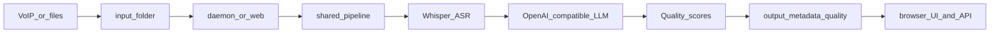

# Call Analytics Platform

[](https://opensource.org/licenses/MIT)
[](https://www.python.org/downloads/)
[](https://github.com/FUYOH666/Scanovich.ai-audio-call)
[](https://github.com/FUYOH666/Scanovich.ai-audio-call/actions/workflows/ci.yml)

Canonical public entrypoint for the repository. For the extended guide and command reference, see [`README_EN.md`](README_EN.md).

## At a glance



- The shared single-file flow lives in [`src/pipeline_service.py`](src/pipeline_service.py).
- The web/API layer lives in [`src/web/app.py`](src/web/app.py).
- The browser UI is a static app under [`src/web/static/`](src/web/static/).
- `main.py web` is the primary entrypoint for the demo and pilot-ready web layer.
- Each successful web analysis persists artifacts to `output/`, `metadata/`, and `quality_analysis/`, which now also power the recent-analyses view.
- Remote OpenAI-compatible LLM endpoints are already supported by config; see [`docs/REMOTE_ASR_AND_LLM.md`](docs/REMOTE_ASR_AND_LLM.md).

## Current product surface

The repository currently has two practical entry modes:

1. `uv run python main.py run` for the long-running daemon pipeline over `input/`.
2. `uv run python main.py web` for a browser UI plus HTTP API over the same shared pipeline.

The web layer supports:

- `GET /healthz`
- `POST /analyze`
- `GET /analyses`
- `GET /analyses/{result_id}`
- `/` for the browser UI

## Quick start

If you are evaluating fit first, start with [`docs/EVALUATION_GUIDE.md`](docs/EVALUATION_GUIDE.md).

### 1. Install

```bash
git clone https://github.com/FUYOH666/Scanovich.ai-audio-call.git call-analytics
cd call-analytics
uv sync
cp config.example.yaml config.yaml
cp branches.example.yaml branches.yaml
```

### 2. Configure the local worker

In `config.yaml`:

```yaml
asr:
  model_preset: "auto"
  device: "cuda"
```

If you want to use a remote OpenAI-compatible LLM instead of a local server, point `vllm.base_url` and `quality_analysis.base_url` at that endpoint. Use placeholders in repo-tracked config and keep real hostnames in local config or environment overrides only.

### 3. Run the web layer

```bash
uv run python main.py web
```

Open `http://127.0.0.1:8080`.

What you can do in the UI today:

- upload one audio file,
- inspect transcript, classification, ASR metrics, and quality output,
- review recent analyses that were already persisted to disk,
- reopen an earlier analysis without re-uploading the file.

### 4. Protect a pilot deployment

```bash
export WEB__REQUIRE_API_KEY=true
export WEB__API_KEY=replace-with-a-strong-key
uv run python main.py web --host 0.0.0.0 --port 8080
```

The browser UI already supports `X-API-Key` through the optional API key field.

### 5. Run the daemon pipeline

```bash
uv run python main.py run
```

Use this mode when VoIP downloaders or other systems write recordings into `input/`.

## Artifact model

The web layer and the daemon share the same persisted artifact story:

- `output/<result_id>.txt` for the cleaned transcript
- `metadata/<result_id>.json` for classification and ASR metrics
- `quality_analysis/individual/<result_id>.json` for quality results when enabled

That persisted state is now reused directly by the recent-analyses API and UI rather than copied into a separate database.

## Documentation map

- [`README_EN.md`](README_EN.md) — extended guide and command reference
- [`docs/README.md`](docs/README.md) — full docs hierarchy
- [`DEPLOYMENT_GUIDE.md`](DEPLOYMENT_GUIDE.md) — deployment and 24/7 operations
- [`docs/ARCHITECTURE.md`](docs/ARCHITECTURE.md) — pipeline and module map
- [`docs/EVALUATION_GUIDE.md`](docs/EVALUATION_GUIDE.md) — pilot-first evaluation path
- [`docs/ROADMAP.md`](docs/ROADMAP.md) — current shipped items and next product steps
- [`PROJECT_OVERVIEW.md`](PROJECT_OVERVIEW.md) — Russian overview and doc map
- [`CHANGELOG.md`](CHANGELOG.md) — change history
- [`FUNDING.md`](FUNDING.md) — support and sponsorship

## Community

- [`CONTRIBUTING.md`](CONTRIBUTING.md) — contribution workflow and repo conventions
- [`SECURITY.md`](SECURITY.md) — responsible reporting and data-handling expectations
- [`CODE_OF_CONDUCT.md`](CODE_OF_CONDUCT.md) — collaboration norms
- [`LICENSE`](LICENSE) — MIT license

## Local-first direction

The local-first story is already partly implemented:

- ASR is in-process Faster-Whisper today.
- LLM post-processing and quality analysis can already use a local or remote OpenAI-compatible server.
- Optional HTTP ASR is a logical next adapter-based step, but it is not implemented in this pass.

## Commercial support

This repository is MIT-licensed and self-hostable. If you need pilot setup, on-prem deployment, or business-specific criteria tuning, see [`FUNDING.md`](FUNDING.md).
