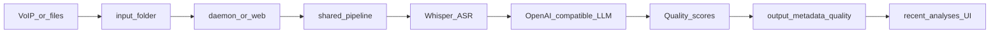

# Call Analytics Platform

[](https://opensource.org/licenses/MIT)
[](https://www.python.org/downloads/)
[](https://github.com/FUYOH666/Scanovich.ai-audio-call)
[](https://scanovich.ai)
[](https://github.com/FUYOH666/Scanovich.ai-audio-call/actions/workflows/ci.yml)

Extended English guide and command reference for the current repository state. For the canonical public overview, see [`README.md`](README.md).

## What this repository is today

This repository ships an on-prem, privacy-first call analytics stack with two usable modes:

1. A daemon pipeline that watches `input/` and processes recordings continuously.
2. A browser UI plus HTTP API that runs through the same shared pipeline for demo and pilot workflows.

The current web layer is not a mock anymore. It is a working product surface backed by persisted artifacts on disk.

## Core architecture



Key implementation points:

- Shared single-file pipeline: [`src/pipeline_service.py`](src/pipeline_service.py)
- Web/API layer: [`src/web/app.py`](src/web/app.py)
- Browser UI: [`src/web/static/`](src/web/static/)
- CLI entry: [`main.py`](main.py) with commands registered from [`src/cli/`](src/cli/)

## Current feature set

- Faster-Whisper transcription
- OpenAI-compatible LLM post-processing for cleanup, masking, and classification
- Optional quality analysis with persisted JSON results
- Browser upload flow over the same backend pipeline used by the CLI
- Recent-analyses list and detail view sourced from existing persisted artifacts
- Optional pilot-safe API key protection for the web layer
- Optional reporting integrations such as Telegram, Google Sheets, SQLite, and CSV

## Requirements

### Recommended production host

- Linux with Python 3.12
- NVIDIA GPU for local Whisper and large local LLM setups
- `uv` for dependency management

### Flexible LLM deployment

The LLM side is already configurable:

- local OpenAI-compatible server,
- remote OpenAI-compatible server over VPN / Tailscale / LAN,
- optional cloud provider path for quality-analysis experiments.

The ASR side is still in-process Faster-Whisper today. Optional HTTP ASR is a logical future extension, but not implemented in this pass.

## Install

```bash
git clone https://github.com/FUYOH666/Scanovich.ai-audio-call.git call-analytics
cd call-analytics
uv sync
cp config.example.yaml config.yaml
cp branches.example.yaml branches.yaml
```

Recommended first checks:

```bash
uv run python main.py health
uv run python main.py --help
```

## Run the web layer

Primary entrypoint:

```bash
uv run python main.py web
```

Advanced equivalent:

```bash
uv run uvicorn src.web.app:app --host 127.0.0.1 --port 8080
```

Open `http://127.0.0.1:8080`.

Available endpoints:

- `GET /healthz`
- `POST /analyze`
- `GET /analyses`
- `GET /analyses/{result_id}`

The UI lets a user:

- upload one new file,
- inspect transcript, classification, ASR metrics, and quality output,
- browse the latest saved analyses,
- reopen a prior analysis from persisted artifacts in `output/`, `metadata/`, and `quality_analysis/individual/`.

## Protected pilot mode

```bash
export WEB__REQUIRE_API_KEY=true
export WEB__API_KEY=replace-with-a-strong-key
uv run python main.py web --host 0.0.0.0 --port 8080
```

The browser UI exposes an optional API-key field and sends `X-API-Key` when present.

## Run the daemon pipeline

```bash
uv run python main.py run
```

Use this when VoIP downloaders or another upstream process write audio into `input/`.

## Artifact model

Each persisted analysis is keyed by the source stem and typically produces:

- `output/<result_id>.txt`
- `metadata/<result_id>.json`
- `quality_analysis/individual/<result_id>.json`

That same artifact model is reused by the recent-analyses list instead of duplicating state in another store.

## Main commands

```bash
uv run python main.py run
uv run python main.py process-file path/to/call.mp3
uv run python main.py web
uv run python main.py health
uv run python main.py metrics
uv run python main.py analyze-quality output/call.txt
uv run python main.py analyze-batch
uv run python main.py report "Operator Name"
uv run python main.py aggregate --period day
uv run python main.py telegram-report --type daily
uv run python main.py sync-sheets
uv run python main.py update-dashboard
uv run python main.py test-sheets
```

## Configuration

Sources of truth:

- [`config.example.yaml`](config.example.yaml)
- [`.env.example`](.env.example)
- [`branches.example.yaml`](branches.example.yaml)

Important current configuration facts:

- Environment overrides use nested names such as `WEB__API_KEY` and `VLLM__BASE_URL`.
- The web layer is configured under `web.*`.
- Remote OpenAI-compatible LLM endpoints are configured via `vllm.*` and `quality_analysis.*`.
- Quality-analysis output directories are only created when that feature is enabled.

## Documentation map

- [`README.md`](README.md) — canonical public overview
- [`docs/README.md`](docs/README.md) — full docs hierarchy
- [`DEPLOYMENT_GUIDE.md`](DEPLOYMENT_GUIDE.md) — deployment and 24/7 operations
- [`docs/ARCHITECTURE.md`](docs/ARCHITECTURE.md) — module and data-flow map
- [`docs/REMOTE_ASR_AND_LLM.md`](docs/REMOTE_ASR_AND_LLM.md) — remote LLM and future HTTP ASR direction
- [`docs/EVALUATION_GUIDE.md`](docs/EVALUATION_GUIDE.md) — pilot-first evaluation path
- [`docs/ROADMAP.md`](docs/ROADMAP.md) — current shipped items and next product steps
- [`PROJECT_OVERVIEW.md`](PROJECT_OVERVIEW.md) — Russian overview and doc map
- [`CHANGELOG.md`](CHANGELOG.md) — change history
- [`FUNDING.md`](FUNDING.md) — support and sponsorship

## Community

- [`CONTRIBUTING.md`](CONTRIBUTING.md) — contribution workflow and repo conventions
- [`SECURITY.md`](SECURITY.md) — responsible reporting and data-handling expectations
- [`CODE_OF_CONDUCT.md`](CODE_OF_CONDUCT.md) — collaboration norms
- [`LICENSE`](LICENSE) — MIT license

## Testing

```bash
uv run pytest tests/
uv run pytest tests/test_api.py tests/test_cli_web.py
```

Current tests include coverage for:

- config validation,
- VLLM post-processing,
- cleanup,
- script parsing,
- web/API behavior,
- CLI launch behavior for `main.py web`.

## Troubleshooting

### Web layer returns 401

Check:

- `WEB__REQUIRE_API_KEY`
- `WEB__API_KEY`
- the `X-API-Key` header or the UI API-key field

### LLM endpoint is unavailable

Run:

```bash
uv run python main.py health
```

Then verify the configured `vllm.base_url` or `quality_analysis.base_url`.

### Recent analyses list is empty

The history UI reads existing artifacts. Run at least one successful analysis first, or verify that the configured `output/`, `metadata/`, and `quality_analysis/individual/` directories contain files.

## Commercial support

This repository is open source under MIT. Paid pilot setup, on-prem deployment, and domain-specific criteria tuning are described in [`FUNDING.md`](FUNDING.md).

