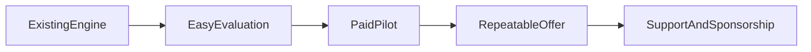

# Productization Plan

This document turns the current repository state into a practical product strategy.

## Status note

This file is now best read as strategic rationale and founder context, not as the live implementation tracker.

Use these files as the current sources of truth:

- `README.md` for the public entrypoint,
- `docs/README.md` for the docs hierarchy,
- `docs/ROADMAP.md` for current shipped items and next improvements,
- `CHANGELOG.md` for what already landed.

The goal is not to rewrite the core pipeline. The goal is to make an already useful on-prem engine easier to evaluate, adopt, and support financially.

## Executive summary

What already exists:

- A working on-prem pipeline from audio files to transcripts, LLM post-processing, quality scoring, and analytics.
- Operational building blocks for long-running usage: CLI, config validation, Docker, systemd, CI, SQLite, Telegram, and Google Sheets.
- A clear privacy-first angle: data can stay on infrastructure the customer controls.

What is still missing:

- A simple product entry point for non-engineers.
- A lightweight evaluation flow that does not require full VoIP integration.
- Public trust signals for contributors, evaluators, and sponsors.
- A clear commercial story that keeps the open-source core intact.

## Why not rewrite

A rewrite would likely destroy leverage instead of creating it.

Reasons:

- The repository already has a coherent pipeline and deployment story.
- The hard part, domain knowledge around call QA, is already encoded in the current modules and templates.
- The biggest adoption gap is packaging, not missing backend depth.
- A rewrite would delay feedback from real users and pilot customers.

Recommendation:

- Keep the current engine.
- Reduce friction around evaluation and onboarding.
- Add only the smallest product layer needed to win pilots and contributors.

## Current positioning

Today the repository is best positioned as:

1. An open-source call analytics engine for teams that want self-hosted control.
2. A pilot-ready on-prem solution for QA-heavy businesses with recurring phone traffic.
3. A foundation for paid deployment, customization, and support services.

It is not yet positioned as:

- A one-click SaaS for non-technical users.
- A multi-tenant platform.
- A real-time coaching product.

## What blocks adoption now

### Product entry

The first-run experience still assumes a technical operator who can:

- install dependencies,
- configure YAML and environment files,
- run CLI commands,
- provide or connect an LLM endpoint.

That is acceptable for engineering-led pilots, but too heavy for managers, founders, and operations leads.

### Evaluation friction

The repository explains how to deploy the system, but an evaluator still has to infer:

- whether their use case fits,
- how many calls to test first,
- what success looks like,
- which outputs matter for a pilot decision.

### Trust and community signals

There is already a strong technical base, but the public repo benefits from a few extra signals:

- a visible CI badge,
- issue and PR templates,
- a contributor-friendly backlog,
- a clear support and sponsorship page.

## Strategic direction

The highest-leverage path is:

That means:

1. Make evaluation easy.
2. Win a few real pilots.
3. Package repeatable services around the open-source core.
4. Use revenue and sponsorship to fund deeper product work.

## Prioritized backlog

The backlog below is ordered by leverage, not by technical novelty.

| Priority | Item | Why now | Expected outcome |
|----------|------|---------|------------------|
| P0 | Add evaluation guide for first pilot | Reduces adoption friction immediately | More people can test without full deployment |
| P0 | Improve README product entry | First impression decides whether evaluators continue | Clearer positioning and faster understanding |
| P0 | Add CI badge and community templates | Cheap trust signals | Better credibility for adopters and contributors |
| P0 | Clarify hardware story across docs | Avoids confusion during pilot planning | Fewer blocked conversations around requirements |
| P1 | Add HTTP API for single-file analysis | Smallest product layer beyond CLI | Easier integration and future UI path |
| P1 | Add minimal web UI for upload and report review | Makes product legible to non-engineers | Better demos and pilot conversations |
| P1 | Publish an evaluation checklist and sample report flow | Helps buyers compare options | Faster pilot qualification |
| P1 | Expand tests around config, CLI happy paths, and report generation | Increases confidence as adoption grows | Safer future changes |
| P1 | Tighten CI to include lint and selected type checks | Turns repo quality into a public signal | Better maintainer confidence |
| P2 | Add basic CRM-ready export story | Helps commercial conversations | Easier path into customer workflows |
| P2 | Add diarization only after pilot demand | High effort, unclear early leverage | Avoids premature complexity |
| P2 | Add multi-tenant SaaS features only after repeatable sales | Expensive to build and operate | Keeps focus on proven demand |

## Monetization without abandoning open source

The business model should preserve the MIT core and charge for time-to-value, customization, and reliability.

### Recommended revenue layers

1. Free open-source core
   The repo remains public and usable for technical teams.

2. Paid pilot package
   A fixed-scope offer for a first deployment, test data setup, and evaluation criteria tuning.

3. On-prem implementation
   Installation, integration, and hardening for a real customer environment.

4. Ongoing support subscription
   Monthly help with upgrades, prompt and criteria tuning, incident response, and analytics adjustments.

5. Sponsorship and donations
   For people who value the mission, use the repo, or want to accelerate roadmap work without buying a full project.

6. Later: hosted edition
   Only after the product entry, support burden, and buyer journey are better understood.

### Pricing logic

Charge for:

- deployment speed,
- customization of evaluation criteria,
- integration work,
- privacy-sensitive self-hosted support,
- operational reliability.

Do not depend on:

- locking essential functionality behind a paywall,
- making the open-source version intentionally weak,
- building a large SaaS before pilot demand exists.

## Execution phases

### Week 1

Focus: repository packaging and evaluation clarity.

Deliverables:

- product strategy doc,
- evaluation guide,
- funding/support page,
- README links and trust signals,
- issue and PR templates.

Success signals:

- A new visitor can understand the project in under five minutes.
- A potential adopter can identify whether a pilot makes sense.
- A potential supporter can see how to help financially.

### Month 1

Focus: lowest-risk product layer.

Deliverables:

- a minimal HTTP API for single-file analysis,
- a small browser-based upload/report interface,
- stronger tests around core user journeys,
- clearer deployment and requirements story.

Success signals:

- One or more external pilot conversations become easier to run.
- A non-engineer can watch or use a demo without reading the whole deployment guide.

### Quarter 1

Focus: repeatable offer and validated demand.

Deliverables:

- repeatable pilot package,
- documented service tiers,
- better observability and CI quality gates,
- first demand-driven integrations.

Success signals:

- At least one repeatable paid offer exists.
- Roadmap priorities are informed by pilot usage, not guesses.
- Support and sponsorship conversations become easier because the offer is concrete.

## Decision rules

Use these rules to keep the roadmap focused:

- Prefer packaging over rewriting.
- Prefer pilots over speculative platform work.
- Prefer simple integration points over heavyweight multi-tenant architecture.
- Prefer revenue that funds the mission over growth that creates support burden too early.
