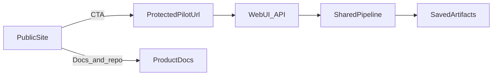

# Product Surfaces

This document defines the clean boundary between the public website and the deployable call analytics product.

## Why this matters

The project now has two different surfaces:

1. a public website for trust, positioning, and CTA,
2. a product repository for the actual pipeline, API, demo UI, deployment, and tests.

Keeping those responsibilities separate avoids release coupling, duplicated logic, and security mistakes.

## Public website

The public site at `scanovich.ai` and the `website-scanovich.ai` repository should own:

- positioning and product narrative,
- screenshots and product tour copy,
- vertical pages and discovery,
- pilot CTA and contact flow,
- links to a live demo or protected pilot URL,
- public SEO and analytics.

The website should not become the hidden runtime home of the GPU-backed app unless its deployment model is intentionally changed.

## Product repository

This repository should remain the source of truth for:

- the shared pipeline in `src/pipeline_service.py`,
- the web/API layer in `src/web/app.py`,
- the static demo UI in `src/web/static/`,
- deployment via `main.py web`, Docker, and systemd,
- config, tests, and technical docs,
- artifact-backed behaviour such as `/analyze`, `/analyses`, and saved-result detail.

## Integration rules

- Do not share runtime code between the website repo and this repo for now.
- Share URLs, screenshots, terminology, and documentation links instead.
- If the website needs a product CTA, point to a separately deployed demo or pilot URL.
- Keep secrets and private hostnames out of the website bundle.
- Keep operational behaviour documented in this repo, not copied into marketing pages.

## Recommended bridge

## Demo URL strategy

The clean default is:

- website page explains the product,
- website CTA opens a separate demo or pilot deployment,
- this repo continues to own the app that actually runs.

That keeps the Render static site independent from the Python service lifecycle.

## Decision rule

If a change affects:

- SEO, product narrative, screenshots, or contact flow: put it on the website,
- API, pipeline, deployment, auth, persistence, or technical behaviour: put it in this repo.
